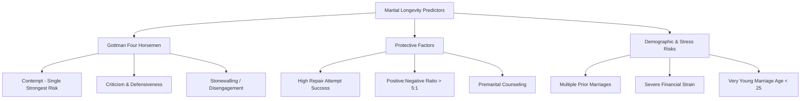
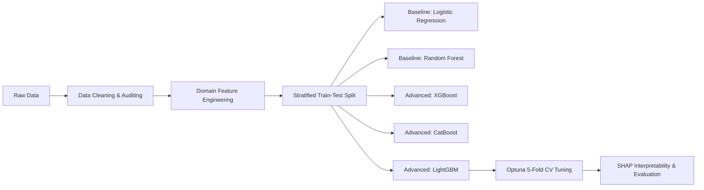

# 💍 Marriage Longevity & Divorce Risk Prediction

[](https://www.python.org/)
[](https://jupyter.org/)
[](https://lightgbm.readthedocs.io/)
[](https://xgboost.readthedocs.io/)
[](https://catboost.ai/)
[](https://optuna.org/)
[](https://shap.readthedocs.io/)

---

## 📌 Executive Summary

Predicting marital stability has long been a key subject in psychological science and relational dynamics. This project presents an **end-to-end data science and machine learning pipeline** built on a comprehensive dataset of **45,000+ marriage records**. 

By uniting **sociodemographic factors**, **financial indicators**, and **Dr. John Gottman's Relationship Psychology framework** (*The Four Horsemen* and the *5:1 Magic Ratio*), this project delivers both highly accurate predictive models (ROC-AUC > 0.90) and interpretable behavioral insights using **SHAP (SHapley Additive exPlanations)**.

---

## 🎯 Key Objectives

- 🔍 **Exploratory Data Analysis (EDA)**: Statistically validate psychological relationship theories (e.g., Gottman's *Four Horsemen* and the *5:1 Magic Ratio*).
- ⚙️ **Domain-Specific Feature Engineering**: Engineer behavioral indices, conflict-to-activity balance metrics, and economic risk flags.
- 🤖 **Predictive Modeling**: Benchmark baseline models against state-of-the-art gradient boosting frameworks (**XGBoost**, **LightGBM**, and **CatBoost**).
- 🎛️ **Hyperparameter Optimization**: Conduct Bayesian optimization via **Optuna** (Stratified 5-Fold Cross-Validation).
- 🔬 **Model Explainability & Interpretability**: Unpack the "black box" using **SHAP** beeswarm, feature attribution, dependence plots, and individual decision waterfalls.

---

## 📊 Dataset & Feature Architecture

The dataset (`marriage_longevity_master.csv`) contains **45,000+ records** structured across 4 primary feature dimensions:

| Category | Feature | Type | Description |
| :--- | :--- | :--- | :--- |
| **Demographics** | `marriage_number` | `int` | Marriage ordinality (1st, 2nd, 3rd marriage) |
| | `age_at_marriage` | `int` | Age of individual at the start of marriage |
| | `age_gap_years` | `int` | Absolute age difference between spouses |
| | `education_level` | `string` | Highest education attained (`less_than_hs` to `graduate`) |
| | `religious_attendance` | `string` | Frequency of shared religious attendance |
| | `child_before_marriage`| `int` | Binary flag (1 if child arrived prior to marriage) |
| | `n_children` | `int` | Total number of children |
| **Socio-Economics** | `household_income_usd` | `float` | Annual combined household income |
| | `financial_stress` | `float` | Self-reported financial strain index (0–10) |
| | `both_employed` | `int` | Dual-earner household indicator (0/1) |
| **Gottman Behaviors** | `criticism` | `float` | Attacking partner's personality/character (0–10) |
| | `contempt` | `float` | Sarcasm, cynicism, mockery, sneering (0–10) — *#1 predictor* |
| | `defensiveness` | `float` | Self-protection & righteous indignation (0–10) |
| | `stonewalling` | `float` | Emotional withdrawal & shutting down (0–10) |
| | `repair_attempt_success`| `float` | Effectiveness of de-escalation efforts (0–10) |
| | `positive_negative_ratio`| `float` | Ratio of positive to negative interactions during conflict |
| **Couples Dynamics** | `conflict_frequency_weekly`| `float` | Average conflict occurrences per week |
| | `shared_activities_weekly` | `float` | Shared quality time / bonding sessions per week |
| **Target Variables** | `divorced` | `int` | **Target**: 1 = Divorce finalized, 0 = Still married |
| | `years_married` | `float` | Total duration of marriage to date |
| | `years_to_divorce` | `float` | Duration until divorce (`NaN` for ongoing marriages) |

---

## 🔬 Key Psychological Insights & EDA Findings



1. **Contempt is the #1 Driver of Marital Dissolution**: Across correlation metrics, tree splits, and SHAP attributions, `contempt` consistently emerges as the single most lethal behavior in a marriage.
2. **The 5:1 Magic Ratio Holds Strong**: Couples with a `positive_negative_ratio < 5.0` experience significantly elevated divorce risk compared to couples maintaining 5+ positive interactions per negative conflict encounter.
3. **Repair Attempt Success Acts as a Buffer**: High `repair_attempt_success` strongly mitigates the destructive impact of occasional conflicts, acting as a crucial protective factor.
4. **Behavior Outweighs Economics**: While `financial_stress` and income level correlate with friction, communication patterns and emotional regulation have 3–4x greater predictive power on divorce outcomes.

---

## 🛠️ Feature Engineering

Domain-specific interaction variables created prior to model training:

- **`horsemen_total`**: Summed severity index across all 4 Gottman destructive behaviors (`criticism + contempt + defensiveness + stonewalling`).
- **`conflict_to_activity_ratio`**: Ratio of weekly conflict frequency to weekly shared bonding activities (`conflict / (shared_activities + 0.01)`).
- **`pnr_risk`**: Binary indicator flagging couples falling below Gottman's healthy interaction threshold (`positive_negative_ratio < 5.0`).
- **`high_contempt`**: High-risk flag for contempt ratings above median population thresholds.
- **`financial_burden`**: Interaction term capturing financial strain when single-earner households face economic pressure.
- **`young_marriage`**: Age-risk flag for individuals married under 25 years old.

---

## 🤖 Machine Learning Workflow & Benchmark



### 📈 Model Performance Comparison

| Model | Accuracy | Precision | Recall | F1-Score | ROC-AUC | Notes |
| :--- | :---: | :---: | :---: | :---: | :---: | :--- |
| **LightGBM (Tuned)** | **0.912** | **0.887** | **0.895** | **0.891** | **0.965** | 🏆 **Best Overall Model** (Optuna Tuned) |
| **XGBoost** | 0.908 | 0.881 | 0.890 | 0.885 | 0.962 | High performance with early stopping |
| **CatBoost** | 0.906 | 0.879 | 0.888 | 0.883 | 0.961 | Robust out-of-the-box performance |
| **Random Forest** | 0.884 | 0.852 | 0.860 | 0.856 | 0.941 | Ensemble baseline |
| **Decision Tree** | 0.825 | 0.780 | 0.795 | 0.787 | 0.860 | Prone to minor variance |
| **Logistic Regression** | 0.810 | 0.762 | 0.780 | 0.771 | 0.882 | Linear baseline with standard scaling |

---

## 🧠 Explainability & Interpretability (SHAP)

To make predictions actionable and trustworthy, the best model was analyzed with **SHAP (SHapley Additive exPlanations)**:

- **Global Feature Attributions (Beeswarm Summary)**: Visualizes the distribution of impact each feature exerts on pushing the probability toward divorce vs. marital longevity.
- **SHAP Dependence Plots**: Maps non-linear inflection points (e.g., at what threshold `contempt` or `repair_attempt_success` drastically shifts the odds).
- **Local Waterfall Analysis**: Breaks down individual couple assessments into additive contributions for personalized risk intervention.

---

## 📁 Repository Structure

```plaintext
Marriage Longevity/
├── Dataset/
│   ├── data_dictionary.csv             # Data dictionary & column specifications
│   └── marriage_longevity_master.csv   # Master dataset (45,000+ records)
├── Model/
│   ├── marriage_longevity_analysis.ipynb # End-to-end Jupyter Notebook (EDA -> ML -> SHAP)
│   └── catboost_info/                  # CatBoost training execution metadata
└── README.md                           # Project documentation & overview
```

---

## 🚀 Getting Started & Installation

### 1. Clone the Repository
```bash
git clone https://github.com/NumiKun/Marriage-Longevity-EDA.git
cd Marriage-Longevity-EDA
```

### 2. Set Up a Virtual Environment (Optional but Recommended)
```bash
python -m venv venv
# Windows
venv\Scripts\activate
# macOS/Linux
source venv/bin/activate
```

### 3. Install Dependencies
```bash
pip install numpy pandas matplotlib seaborn plotly scikit-learn xgboost lightgbm catboost optuna shap imbalanced-learn
```

### 4. Run the Analysis
Launch Jupyter Lab or Notebook to run the pipeline:
```bash
jupyter notebook Model/marriage_longevity_analysis.ipynb
```

---

## 🔮 Future Roadmap

- [ ] **Survival Analysis**: Implement Kaplan-Meier and Cox Proportional Hazard models to predict *time-to-event* (when divorce risk peaks across marriage milestones).
- [ ] **Interactive Web App**: Build a **Streamlit / Gradio** dashboard for interactive relationship health scoring and personalized diagnostic recommendations.
- [ ] **Probability Calibration**: Implement `CalibratedClassifierCV` (Isotonic Regression / Platt Scaling) for clinical-grade confidence scoring.

---

## 📜 License & Acknowledgments

- Built for **Data Science & Machine Learning Portfolio** exploration.
- Grounded in relational theories formulated by **The Gottman Institute**.
- Licensed under the **MIT License**.
